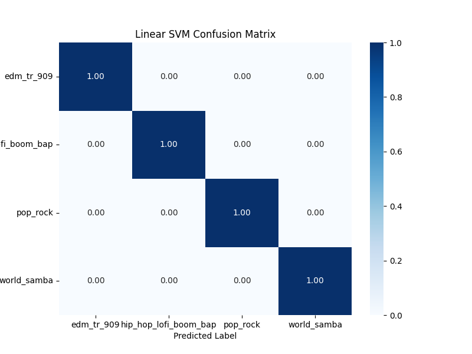

# SVM and Random Forest Genre Classifier of Drum Loops

The objective of this project is to survey Machine Learning algorithms for the purpose of genre classifications of drums.

# Methodology
## Dataset
A custom dataset was created using the [Waiveops](https://www.patchbanks.com/waivops/) dataset created by the people at Patchbanks.
Each audio file was loaded using librosa of 5 second duration. And in order to not have any distortion. I added a 0.5 second fadeout. 
`make_csv.py` creates an annotations file for each folder. `extract_features.py` extract all the features specified and stores it as a `.npz` file.

In order to maintain equal contribution from each class, the `_dataloader.py` script creates equal slices and concatnates it to create one set. Which is later split into test and train sets. 

## Feature Selection
Feature selection is the most crucial part.
1. 13 MFCC coefficients were extracted from the 5 second clip as the main feature.
2. Onset Strength
3. Zero Crossing Rate.

The features were first normalized using a simple min-max normalization equation. 
To construct the feature vector, the mean over time produced a 1 x 15 vector. 

## Model Setup

> add information about the models...

## Results
| Model    | Accuracy | Precision | Recall| F1-Score| 
| -------- | ------- | --------| -----|------|
|Linear SVM | 0.83| 0.84 | 0.83 | 0.83 |
|Radial Basis Function SVM| 0.98 | 0.98 | 0.98|0.98|
|Random Forest| 0.97 | 0.97 | 0.97|0.97|

# Discussion
Initially a total of 13 features were selected. creating a 1x60 vector. Here is the correlation matrix.

This caused underfitting.

---
Another cause of underfitting/overfitting was the introduction of bias. I was choosing median and skew in order to represent the MFCC feature to make up for the loss of temporal data. But this was an unecessary bias. Limiting the model to be able to generalize. 
Another feature that was causing underfitting was BPM. Eventhough it is obvious to us that BPM is heavily tied to drums. It is a secondary feature that can be inferred using ZCR. 
Here we have the confusion matrix of the linear SVM with BPM included in the feature vector.

Here I have removed the BPM.

